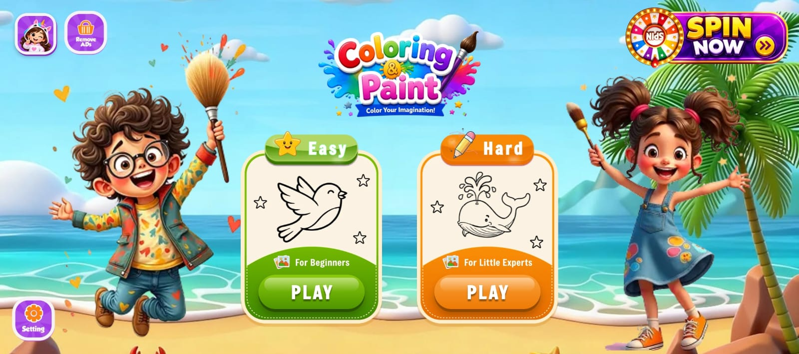
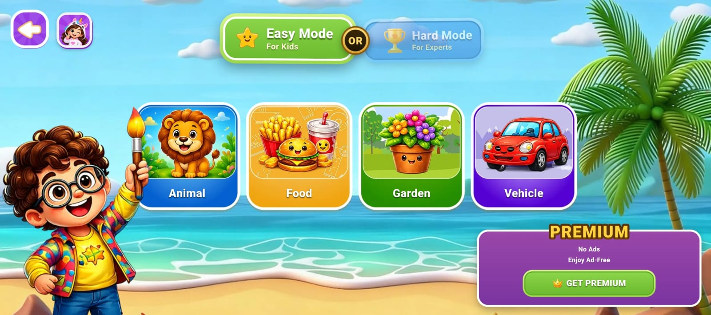
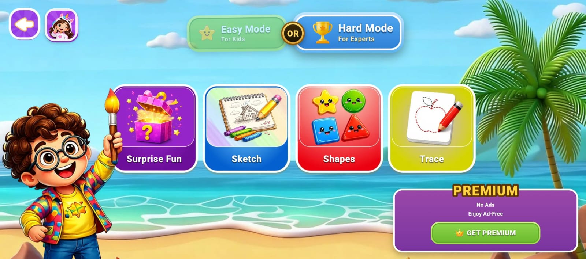
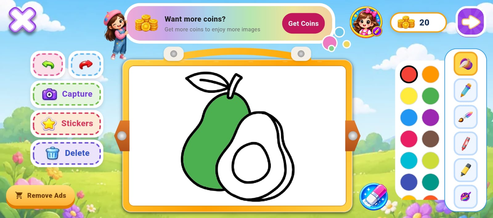
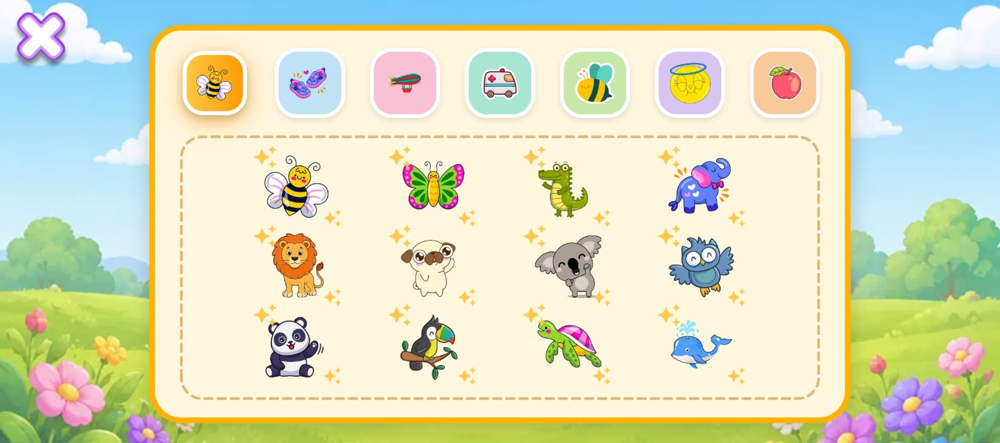
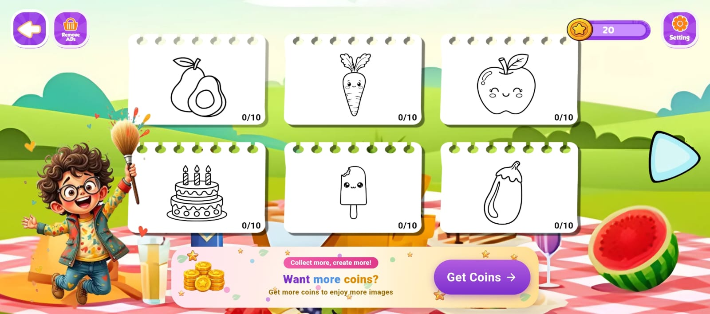
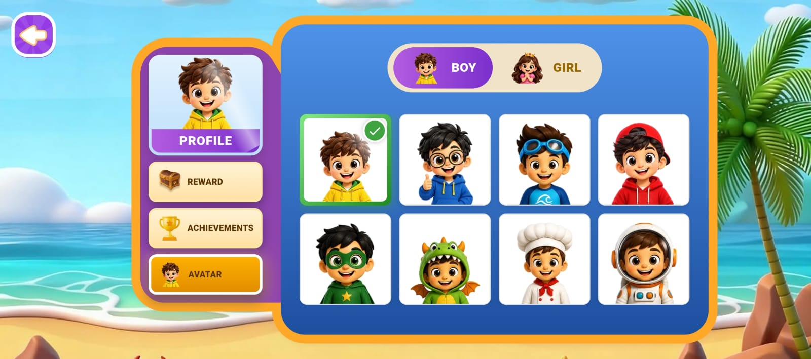
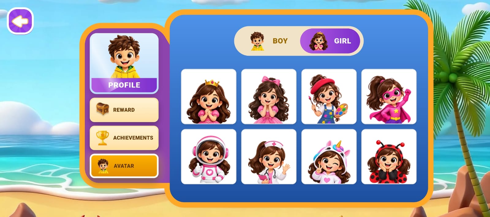
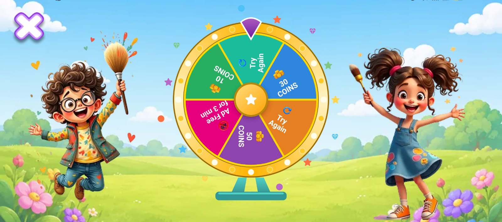
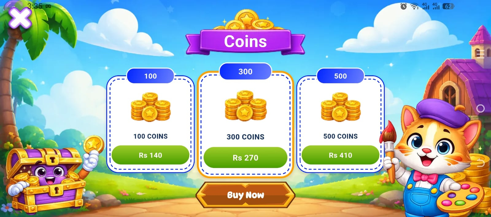

# Drawing App

A production Flutter application focused on interactive drawing and coloring experiences, custom UI/UX, animations, performance optimization, user engagement, and monetization.

> Professional project developed as part of a product team.

---

## Overview

Drawing App is a creative mobile application designed to provide users with an engaging and interactive drawing and coloring experience.

I contributed to the development and improvement of the application across mobile development, UI/UX, performance, app stability, analytics, advertising, monetization, and user engagement.

The application combines a game-inspired visual experience with creative drawing tools, illustrated characters, animations, rewards, and interactive content.

---

## My Role

**Flutter Developer**

My contributions included:

- Developing and improving Flutter application features
- Building custom UI/UX and interactive interfaces
- Implementing animations and game-inspired experiences
- Developing drawing and coloring functionality
- Working with drawing tools and interactive elements
- Optimizing application performance
- Investigating and resolving crashes and ANR issues
- Integrating Firebase services
- Working with Firebase Analytics and Remote Config
- Integrating and optimizing Google AdMob
- Implementing rewarded advertisements
- Working on coins and reward logic
- Implementing subscription-related features
- Working on daily rewards and earning mechanics
- Improving user engagement and application flows
- Supporting production releases and continuous app improvements

---

## Key Features

### Drawing & Creative Tools

- Brush tool
- Pencil tool
- Bucket / fill tool
- Crayon tool
- Highlighter tool
- Eraser
- Undo and redo
- Stickers
- Shapes
- Tracing images
- Sketching experiences
- Interactive coloring tools

### Content & Categories

- Multiple themed categories
- Animal illustrations
- Vehicle illustrations
- Character and cartoon content
- Sketches and creative illustrations
- Surprise and fun content
- Different difficulty levels
- Custom visual content

### Visual Experience

- Game-inspired UI/UX
- Custom illustrations
- Character-based experiences
- Interactive animations
- Custom-designed interfaces
- Engaging visual interactions
- AI-assisted image creation and content preparation
- Python scripting for image and asset preparation

### Rewards & Monetization

- Coins system
- Reward system
- Daily earning mechanics
- Rewarded advertisements
- Ad-based rewards
- Subscription features
- Content and image unlocking
- Monetization flows

### Analytics & Production

- Firebase Analytics
- Firebase Remote Config
- Firebase Crashlytics
- Google AdMob
- Performance monitoring
- Crash investigation and optimization
- ANR monitoring and improvements
- Production release management

---

## Technologies

| Technology | Usage |
|---|---|
| Flutter | Mobile application development |
| Dart | Application programming |
| Firebase | Application services and infrastructure |
| Firebase Analytics | User behavior and product analytics |
| Firebase Remote Config | Remote feature and configuration management |
| Firebase Crashlytics | Crash monitoring and stability |
| Google AdMob | Advertising and monetization |
| Python | Image and asset preparation scripts |
| Figma | UI/UX design and prototyping |

---

## Performance & Engineering

Performance and application stability were important parts of the development process.

I worked on:

- Identifying performance bottlenecks
- Optimizing resource-intensive operations
- Improving drawing-related performance
- Investigating application crashes
- Working on ANR-related issues
- Improving application stability
- Optimizing user interactions
- Improving application flows
- Monitoring production behavior through analytics and Crashlytics

---

## UI/UX & Design

The application was designed with a strong focus on creating a fun, interactive, and game-like experience for users.

My work included:

- Custom Flutter UI
- Interactive components
- Custom drawing interfaces
- Animations
- Character-based experiences
- Custom icons and controls
- Drawing canvas experience
- Stickers and interactive elements
- User-friendly navigation
- Engagement-focused UI improvements
- Figma-based design implementation

---

## Content Creation

The application contains a large collection of custom visual content and illustrations.

I also worked with **Python scripts and AI-assisted workflows** to help create and prepare visual assets and images used within the application.

The content includes:

- Animals
- Vehicles
- Characters
- Cartoons
- Sketches
- Tracing images
- Shapes
- Creative and surprise content

---

## Monetization & Engagement

I worked on multiple monetization and engagement systems, including:

- Google AdMob integration
- Rewarded advertisements
- Coins and reward logic
- Daily earning mechanics
- Subscription features
- Content unlocking
- Image unlocking
- Ad-based rewards
- Monetization flow improvements

---

## Screenshots

### Home & Categories

### Drawing Experience

### Characters & User Experience

### Rewards & Monetization

---

## App Demo

A short walkthrough showcasing the application's interface, drawing experience, animations, interactions, and overall user experience.

---

## Technical Focus

This project allowed me to work across multiple areas of production mobile development:

**Flutter Development → Custom UI/UX → Animations → Drawing Features → Performance → Firebase → Analytics → Crash Management → AdMob → Monetization → Production Releases**

---

## Project Highlights

- Built and improved production Flutter features
- Worked on a highly customized game-inspired UI
- Developed interactive drawing and coloring experiences
- Worked on application performance and stability
- Investigated crashes and ANRs
- Implemented Firebase Analytics and Remote Config
- Worked with Firebase Crashlytics
- Integrated Google AdMob and rewarded ads
- Developed coins, rewards, and subscription logic
- Worked on AI-assisted visual content creation
- Used Python scripting for asset preparation
- Contributed to continuous production improvements

---

## Disclaimer

This repository is a **portfolio case study** and does not contain the application's source code.

The original application was developed as part of a professional product team. Proprietary source code, private assets, credentials, client information, and confidential company materials are not included in this repository.

---

## About Me

I am a Flutter Developer with 5+ years of hands-on experience in mobile application development, currently expanding my skills toward **backend development, Node.js, and AI**.

I am also pursuing a **BS in Business & Information Technology (BBIT) at Virtual University of Pakistan**, developing my knowledge across both technology and business.

---

## Connect With Me

- [LinkedIn](https://www.linkedin.com/in/bisma-dev/)
- [Email](mailto:bismanaz674@gmail.com)
