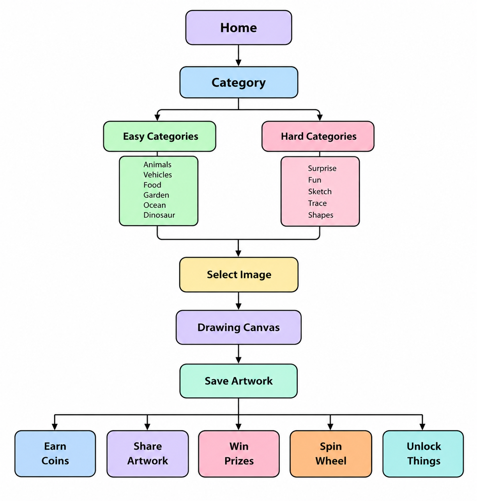
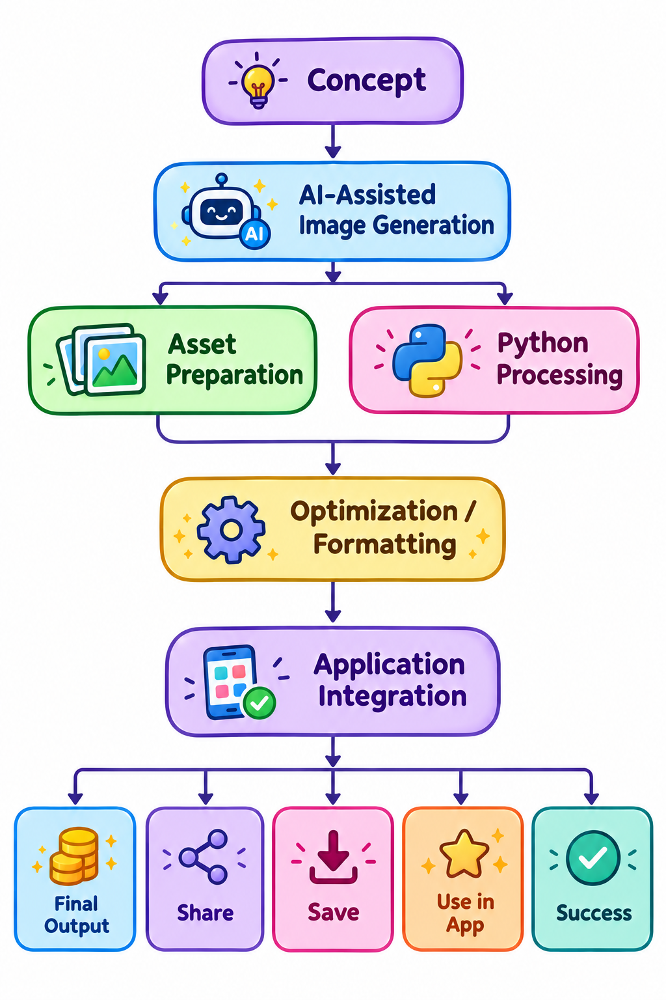
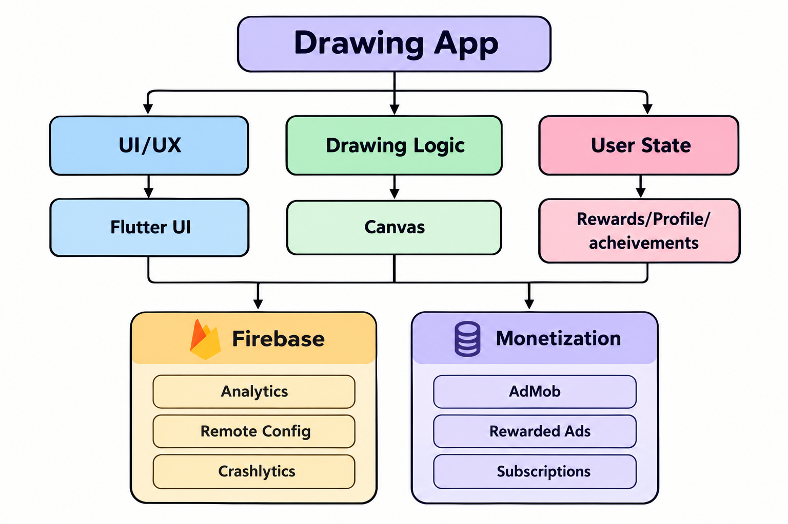
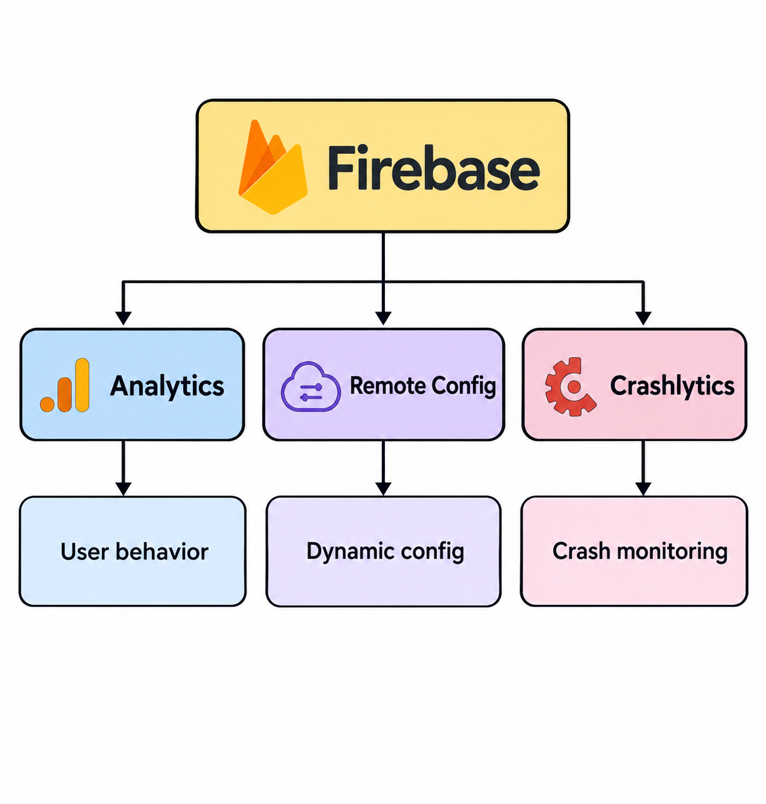
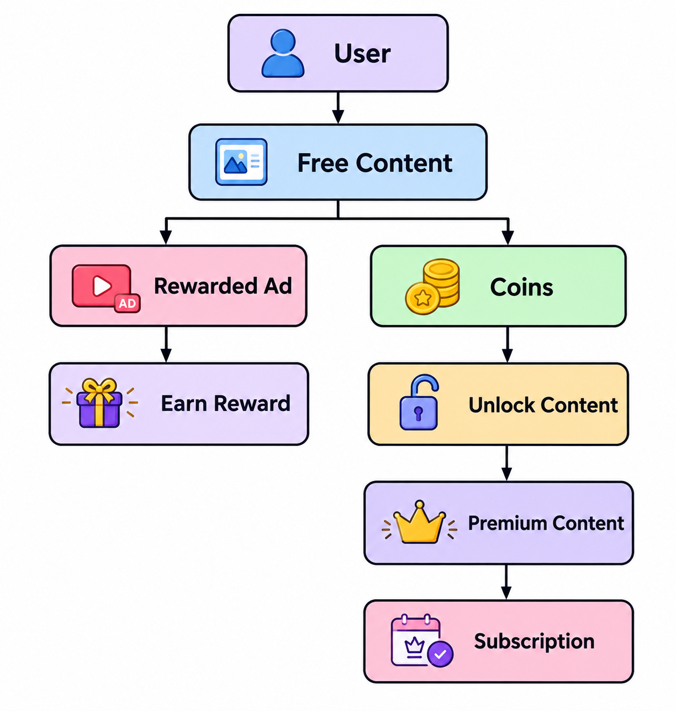

# 🎨 Drawing App

### Interactive Flutter Drawing & Coloring Experience

A production Flutter mobile application focused on interactive drawing and coloring experiences, custom UI/UX, animations, creative content, user engagement, monetization, and production performance.

> **Portfolio Case Study**  
> This repository presents my contributions and technical experience on a production application. Proprietary source code and confidential company materials are not included.

---

## 📱 Project Overview

Drawing App is a creative mobile application designed to provide users with an engaging and interactive drawing and coloring experience.

The application combines a game-inspired visual experience with creative drawing tools, illustrated characters, animations, rewards, interactive content, and monetization features.

I contributed to the development and continuous improvement of the application across **Flutter development, UI/UX, drawing functionality, performance optimization, production stability, Firebase services, advertising, monetization, and user engagement**.

---

## 📌 Project Facts

| Area | Details |
|---|---|
| **Role** | Flutter Developer |
| **Platform** | Android & iOS |
| **Framework** | Flutter |
| **Language** | Dart |
| **Backend / Services** | Firebase |
| **Monetization** | AdMob, Rewarded Ads, Coins, Subscriptions |
| **Design** | Figma |
| **Project Type** | Production Mobile Application |

---

## 🎯 Product Goal

The goal of the application is to provide a simple yet engaging creative experience where users can explore visual content, select artwork, and interact with it through different drawing and coloring tools.

The product combines:

- Creative drawing and coloring
- Interactive visual experiences
- Game-inspired UI/UX
- Rewards and engagement mechanics
- Unlockable content
- Advertising and subscription-based monetization

---

# 👩‍💻 My Role

## Flutter Development

- Developed and improved production Flutter features
- Implemented application flows and interactive functionality
- Developed drawing and coloring experiences
- Worked on drawing tools and interactive elements
- Supported continuous production improvements and releases

## UI/UX & Interaction

- Implemented custom Flutter UI/UX
- Built interactive interfaces and components
- Implemented custom animations
- Worked on game-inspired visual experiences
- Implemented Figma designs into Flutter
- Improved navigation and user flows
- Improved visual consistency across application screens

## Drawing & Creative Experience

- Worked on drawing and coloring functionality
- Implemented and improved drawing tools
- Worked with interactive canvas experiences
- Worked with stickers and shapes
- Worked with tracing experiences
- Worked on undo and redo functionality
- Improved the overall drawing interaction
- Improved the creative workflow for users

## Performance & Stability

- Investigated performance bottlenecks
- Worked on drawing-related performance
- Investigated crashes and ANR-related issues
- Improved application stability
- Optimized user interactions and application flows
- Monitored production behavior
- Worked on performance-sensitive drawing operations

## Firebase & Production Services

- Firebase Analytics
- Firebase Remote Config
- Firebase Crashlytics
- Production monitoring
- Crash investigation
- Remote configuration management
- Product behavior analysis

## Monetization & Engagement

- Google AdMob integration
- Rewarded advertisements
- Coins and reward logic
- Daily earning mechanics
- Content and image unlocking
- Subscription-related features
- Engagement-focused flows
- Ad-based reward experiences

---

# ✨ Key Features

## 🎨 Drawing & Creative Tools

The application provides multiple tools for creating interactive drawing and coloring experiences.

- Brush
- Pencil
- Bucket / Fill
- Crayon
- Highlighter
- Eraser
- Undo / Redo
- Stickers
- Shapes
- Tracing images
- Sketching experiences
- Interactive coloring tools

---

## 🖼️ Content & Categories

The application contains multiple types of creative and illustrated content.

- Animals
- Vehicles
- Characters
- Cartoons
- Sketches
- Creative illustrations
- Tracing images
- Surprise content
- Different difficulty levels
- Custom visual content

---

## 🎭 Visual Experience

The application focuses heavily on visual engagement and interactive experiences.

- Game-inspired UI/UX
- Custom illustrations
- Character-based experiences
- Custom-designed interfaces
- Interactive animations
- Custom icons and controls
- Visual feedback
- Interactive drawing elements
- Engaging transitions
- Creative visual interactions

---

## 🪙 Rewards & Monetization

The application combines multiple engagement and monetization mechanisms.

- Coins
- Rewards
- Daily earning mechanics
- Rewarded advertisements
- Ad-based rewards
- Content unlocking
- Image unlocking
- Subscription features

---

# 🔄 User Flow

The main user journey moves from discovering creative content to selecting artwork and entering the drawing experience.

### Core Journey

**Home → Category → Difficulty → Artwork → Drawing Canvas → Creative Tools → Completed Artwork**

The flow is designed to move users quickly from content discovery into the core creative experience.

---

# 🗂️ Content & Category Structure

The application organizes creative artwork into multiple categories and difficulty levels.

The content structure allows users to explore different themes and select artwork according to the available categories and difficulty levels.

The overall content organization is designed to make artwork discovery simple and intuitive before users enter the drawing experience.

---

# 🏗️ Application Architecture

The application combines Flutter UI, drawing functionality, application flows, Firebase services, analytics, crash monitoring, advertising, rewards, and monetization components.

The architecture diagram presents the major functional areas of the production application without exposing proprietary implementation details.

### Main Functional Areas

- Flutter application
- UI / UX
- Drawing and coloring functionality
- Interactive tools
- Application flows
- Firebase services
- Analytics
- Crash monitoring
- Advertising
- Rewards
- Monetization

---

# 🔥 Firebase Architecture

Firebase services were used to support analytics, remote configuration, crash monitoring, and production application management.

### Firebase Services

| Service | Purpose |
|---|---|
| **Firebase Analytics** | Product and user behavior analytics |
| **Firebase Remote Config** | Remote configuration and supported feature management |
| **Firebase Crashlytics** | Crash monitoring and stability investigation |

These services supported continuous monitoring and improvement of the production application.

---

# 💰 Monetization & Engagement Flow

The application combines creative experiences with rewards, coins, advertising, content unlocking, and subscription-based features.

### Monetization Components

- Google AdMob
- Rewarded advertisements
- Coins
- Daily rewards
- Content unlocking
- Image unlocking
- Subscription features

### Engagement

Reward-based interactions provide users with additional ways to engage with the application while supporting its monetization strategy.

---

# 🎨 UI/UX & Design

The application was designed around a fun, interactive, and visually engaging experience.

## Design Focus

- Simple and intuitive navigation
- Strong visual hierarchy
- Interactive feedback
- Game-inspired visual language
- Engaging creative experiences
- Easy access to drawing tools
- Consistent visual interactions
- Clear content discovery

## Design Workflow

My work included translating Figma designs into responsive Flutter interfaces while maintaining the intended visual and interaction experience.

### Design Process

**Figma → Flutter UI → Interactive Components → Animations → Testing → Refinement → Production**

---

# 🎬 App Demo

A short walkthrough showcasing the application's interface, drawing experience, animations, interactions, and overall user experience.

---

# 📸 Screenshots

## 🏠 Home & Content Discovery

### Home

The home experience introduces users to the application's creative content and drawing activities.

### Easy Categories

Content organized around an easier difficulty level for accessible creative experiences.

### Hard Categories

More challenging artwork and creative content.

---

## 🖌️ Drawing Experience

### Choose Artwork

Users can select artwork before entering the interactive drawing experience.

### Drawing Canvas

The main interactive workspace for drawing and coloring.

### Stickers & Creative Elements

Additional creative elements can be used within the drawing experience.

---

## 👤 Characters & User Experience

### Avatars

Character and avatar experiences supporting the application's visual identity and engagement.

### Profile

User-focused profile and application experience.

---

## 🪙 Rewards & Monetization

### Spin Wheel

A reward-driven interaction designed to support user engagement.

### Get Coins

Coin and reward experience used within the application's content unlocking and monetization flows.

---

# ⚙️ Technical Implementation

## Drawing & Interaction

The drawing experience includes multiple interactive tools designed to provide users with different ways to create and modify artwork.

The experience includes:

- Brush
- Pencil
- Crayon
- Highlighter
- Eraser
- Bucket / Fill
- Undo / Redo
- Stickers
- Shapes
- Tracing
- Interactive coloring

The implementation focuses on responsive interactions and an accessible creative workflow.

---

# 🧩 Rendering Approach

A major engineering focus of the drawing experience was improving how artwork could be processed and colored.

## Challenge

Pixel-level image processing can become resource-intensive when artwork requires repeated scanning or processing of image data.

This can affect:

- UI responsiveness
- Drawing interactions
- Memory usage
- Overall application performance

## Approach

Supported coloring content was moved toward an **SVG-based approach**, allowing artwork regions to be represented in a more structured way for interactive coloring.

## Engineering Focus

- Reduce unnecessary pixel-level processing
- Improve responsiveness during coloring interactions
- Support region-based coloring
- Improve the overall drawing experience
- Reduce processing overhead for supported artwork

This approach was part of the broader effort to improve drawing performance and application responsiveness.

---

# ⚡ Performance & Engineering

Performance and application stability were important parts of the production development process.

## Areas I Worked On

- Identifying performance bottlenecks
- Optimizing resource-intensive operations
- Improving drawing-related performance
- Investigating application crashes
- Investigating ANR-related issues
- Improving UI responsiveness
- Optimizing user interactions
- Improving application flows
- Monitoring production behavior

## Production Monitoring

Firebase Analytics and Crashlytics were used to help monitor application behavior and investigate production issues.

Performance improvements were approached by identifying problematic operations, investigating their impact, and applying targeted optimizations.

---

# 🐛 Crash & ANR Investigation

Production stability was an important part of maintaining the application.

When crashes or ANR-related issues were identified, the investigation process involved:

**Production Issue → Crash / Performance Data → Investigation → Fix → Testing → Release → Monitoring**

This created a continuous feedback loop between production monitoring and engineering improvements.

---

# 🧩 Engineering Challenges & Solutions

## 1. Drawing Performance

### Challenge

Some drawing and image-processing operations could become resource-intensive and affect responsiveness.

### Approach

Investigated the drawing and rendering workflow and optimized the way supported artwork was processed.

### Outcome

Improved the responsiveness and overall quality of the drawing experience.

---

## 2. Production Stability

### Challenge

Production applications can encounter crashes and ANR-related issues that may be difficult to reproduce during normal development.

### Approach

Used production monitoring and crash diagnostics to investigate problematic areas and identify potential causes.

### Outcome

Implemented targeted fixes and stability improvements across the application.

---

## 3. Dynamic Configuration

### Challenge

Some application configuration and product behavior required the ability to be adjusted without depending entirely on a new application release.

### Approach

Used Firebase Remote Config for supported remote configuration requirements.

### Outcome

Provided more flexibility for production configuration and product updates.

---

## 4. User Engagement

### Challenge

A creative application needs users to continue exploring content and interacting with the product.

### Approach

Worked on rewards, daily earning mechanics, coins, rewarded advertisements, unlockable content, and interactive experiences.

### Outcome

Created a structured engagement system around the application's creative content.

---

## 5. Visual Content Preparation

### Challenge

A drawing and coloring application requires a large collection of visual assets while maintaining consistency and usability across different artwork.

### Approach

Worked with AI-assisted workflows and Python-based processing to help prepare and organize visual assets.

### Outcome

Supported a structured workflow for preparing creative content for application use.

---

# 🧠 Key Technical Decisions

| Decision | Purpose |
|---|---|
| **Flutter** | Cross-platform mobile application development |
| **Dart** | Application development |
| **SVG-based artwork** | Structured artwork representation for supported interactive coloring |
| **Firebase Analytics** | Product and user behavior analytics |
| **Firebase Remote Config** | Remote configuration |
| **Firebase Crashlytics** | Production crash monitoring |
| **Google AdMob** | Advertising and monetization |
| **Rewarded Ads** | Reward-based engagement |
| **Subscriptions** | Premium monetization |
| **Python Scripts** | Visual asset preparation and processing |
| **Figma** | UI/UX design and prototyping |

---

# 🤖 Content Creation & Asset Workflow

The application contains a large collection of visual content and illustrations.

I worked with **AI-assisted workflows and Python scripts** to support the creation, preparation, and processing of visual assets.

### Workflow Focus

The workflow helped organize the process from visual content requirements through preparation and application integration.

It supported:

- Visual content preparation
- Asset processing
- Image optimization
- Content organization
- Application integration

AI-assisted tools were used as part of the content workflow rather than as a replacement for application development.

---

# 📊 Product & Analytics

Analytics played an important role in understanding how users interacted with the application.

Firebase Analytics was used to support:

- User behavior analysis
- Product interaction tracking
- Engagement analysis
- Feature usage insights
- Production decision-making

Analytics and production monitoring helped identify areas where application flows and user experiences could be improved.

---

# 🪙 Monetization Strategy

The application uses multiple monetization and engagement mechanisms rather than relying on a single revenue source.

## Advertising

Google AdMob was integrated into the application to support advertising-based monetization.

## Rewarded Ads

Rewarded advertisements were used as part of the reward system, allowing users to interact with ads in exchange for application rewards.

## Coins

Coins provide an in-app reward mechanism that can be used within content unlocking flows.

## Subscriptions

Subscription-related features provide a premium monetization path for users who want additional application benefits.

## Content Unlocking

Selected content and images can be connected to the application's reward and monetization systems.

---

# 🔁 Production Development Workflow

Working on a production application required continuous iteration rather than a one-time development cycle.

**Feature / Requirement → UI/UX Implementation → Flutter Development → Testing → Debugging → Performance Review → Production Release → Monitoring → Improvements**

This workflow helped balance new features with stability, performance, and user experience.

---

# 🚀 Production Development

This project provided experience working on a continuously evolving production application.

My production responsibilities included:

- Feature development
- UI/UX improvements
- Bug fixing
- Performance optimization
- Crash investigation
- ANR investigation
- Analytics monitoring
- Remote configuration
- Monetization improvements
- Reward system improvements
- Content unlocking
- User engagement improvements
- Production release support
- Continuous application improvements

---

# 🛠️ Tech Stack

## Mobile Development

- Flutter
- Dart

## Firebase

- Firebase Analytics
- Firebase Remote Config
- Firebase Crashlytics

## Monetization

- Google AdMob
- Rewarded Ads
- Subscriptions
- Coins & Rewards

## Design

- Figma
- Custom UI/UX
- Interactive visual design
- Animations

## Content & Automation

- Python
- AI-assisted visual content workflows
- Asset preparation and processing

---

# 📚 Skills Demonstrated

## Mobile Development

- Flutter
- Dart
- Responsive UI
- Interactive components
- Custom application flows

## UI/UX

- Figma
- Custom interface implementation
- Visual hierarchy
- Interaction design
- Animations
- Game-inspired UI

## Engineering

- Performance optimization
- Debugging
- Crash investigation
- ANR investigation
- Production monitoring
- Technical problem-solving

## Firebase & Services

- Firebase Analytics
- Firebase Remote Config
- Firebase Crashlytics

## Product & Monetization

- AdMob
- Rewarded advertisements
- Coins
- Subscriptions
- Content unlocking
- Engagement flows

## Content & Automation

- Python scripting
- AI-assisted workflows
- Visual asset preparation

---

# 🌟 Project Highlights

- Contributed to a production Flutter mobile application
- Developed and improved interactive drawing and coloring experiences
- Worked on highly customized, game-inspired UI/UX
- Implemented and improved drawing tools and interactions
- Worked on SVG-based coloring improvements
- Investigated performance bottlenecks
- Investigated crashes and ANR-related issues
- Integrated Firebase Analytics and Remote Config
- Worked with Firebase Crashlytics
- Integrated Google AdMob and rewarded advertisements
- Worked on coins, rewards, and subscription features
- Worked on content unlocking and engagement flows
- Used AI-assisted workflows for visual content preparation
- Used Python scripting for asset preparation
- Supported continuous production improvements and releases

---

# 💡 Product Thinking

Beyond implementation, this project provided experience thinking about the application from a product perspective.

Important considerations included:

- How quickly users reach the core creative experience
- How content is organized and discovered
- How rewards influence engagement
- How monetization can coexist with the user experience
- How application performance affects user experience
- How production analytics can guide improvements
- How visual design influences interaction

This helped connect technical implementation with the overall product experience.

---

# 📖 What I Learned

Working on this application strengthened my experience in several areas of production mobile development.

## Technical

- Building and maintaining production Flutter applications
- Developing highly interactive mobile interfaces
- Working with performance-sensitive drawing experiences
- Improving application responsiveness
- Working with Firebase production services
- Investigating crashes and ANR-related issues

## Product

- Designing flows around user engagement
- Working with monetization systems
- Understanding reward-based interactions
- Balancing advertisements with user experience
- Using analytics to understand product behavior

## Design

- Translating Figma designs into functional interfaces
- Creating interactive visual experiences
- Working with animations
- Maintaining visual consistency
- Designing simple and engaging interactions

## Content

- Working with large collections of visual assets
- Using AI-assisted workflows
- Using Python scripts for asset preparation
- Preparing visual content for application integration

---

# 🔮 Future Improvements

Potential areas for future improvement include:

- Additional creative drawing tools
- Expanded creative content
- More personalization
- Improved accessibility
- Further drawing performance improvements
- Additional engagement experiences
- Enhanced offline capabilities where appropriate
- More advanced creative interactions

---

# 🏢 Project Context

This project was developed as part of a professional product team.

My contribution focused on:

**Flutter Development → UI/UX → Drawing Experience → Performance → Stability → Firebase → Analytics → Monetization → Production Improvements**

The repository is intentionally structured as a **portfolio case study** rather than a source-code repository.

---

# 🔐 Source Code & Confidentiality

The original production source code is not included in this repository.

This is intentional because the application was developed as part of a professional product environment.

The repository does not contain:

- Proprietary source code
- Private company assets
- Credentials
- API keys
- Internal configuration
- Client information
- Confidential business information
- Private backend implementation

The purpose of this repository is to document my **technical contribution, problem-solving approach, product understanding, and production experience**.

---

# ⚠️ Disclaimer

This repository is a **portfolio case study** and does not contain the application's source code.

The original application was developed as part of a professional product team. Proprietary source code, private assets, credentials, client information, internal company materials, and other confidential information are intentionally excluded from this repository.

The screenshots, diagrams, and descriptions included here are presented for portfolio and professional documentation purposes.

---

# 👩‍💻 About Me

I am a **Flutter Developer with 5+ years of hands-on experience in mobile application development**, with a strong focus on custom UI/UX, interactive experiences, performance, and production applications.

I am currently expanding my skills toward **backend development, Node.js, and AI**, while pursuing a **BS in Business & Information Technology (BBIT) at Virtual University of Pakistan**.

My interests include:

- Mobile Development
- Flutter
- Backend Development
- AI
- UI/UX
- Product Development
- Business & Technology

---

# 🎯 Career Interests

I am interested in opportunities involving:

- Flutter / Mobile Development
- Backend Engineering
- Full-Stack Development
- AI-powered Applications
- UI/UX-focused Product Development
- Software Engineering
- Product Development
- Business & Technology

---

# 🤝 Connect With Me

---

# ⭐ Portfolio

More projects and case studies are available on my GitHub profile:

**GitHub:**  
https://github.com/bismanaz12

---

### 🎨 Built for creativity.
### ⚡ Engineered for performance.
### 📱 Developed with Flutter.

